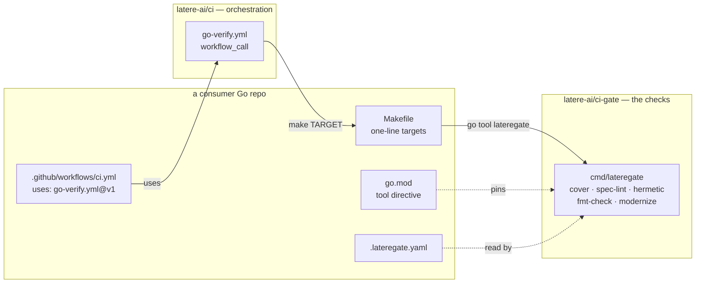

# One per-push quality bar for every Go repo

## Context for whoever picks this up

`latere-ai/ci` centralizes **release**: three `workflow_call` pipelines
(`service-release.yml`, `cli-release.yml`, `images-release.yml`), all
triggered by a version tag. It centralizes nothing about the **per-push**
gates — test, lint, coverage, spec hygiene — so every Go repo builds those
itself, or does not build them at all.

### What the org actually looks like

A survey of every repo with a `go.mod` on 2026-08-29:

| Property | Repos |
| --- | --- |
| Go repos | 21 |
| Spec-driven (`specs/*.md`, between 1 and 116 specs) | 18 |
| Have `fmt-check` + `test` + `lint-modernize` | 15 |
| Have `cover` | 8 |
| Have `test-hermetic`, `test-race` or `validate` | 1 (llmops) |
| Have a per-package coverage gate | 2 (llmops, tgo) |
| Have a spec linter | 2 (tgo; llmops has tests only, no implementation) |
| Have no `Makefile` at all | tgo — its `ci.yml` runs commands inline |
| Have no workflows at all | latere-cli, llm-gateway-bench |

Two numbers set the design. **Eighteen repos are spec-driven and
seventeen of them lint nothing**, so their frontmatter, indexes and
dependency edges are maintained by hand. And **one repo of twenty-one**
meets the full gate contract, so the problem is not that two copies of
`covercheck` exist. It is that adoption currently costs a repo seven
hand-written make targets, which is the same duplication relocated from
workflows into Makefiles.

## Why this is worth doing, concretely

Three llmops CI failures on 2026-08-29 shared one root cause: **tests that
depended on what happened to be installed on the machine running them.**

1. A test shelled out to `systemctl daemon-reload`. macOS has no
   `systemctl`, so the code took its "not found, skip" branch and the test
   passed. The Linux runner *has* systemctl but unprivileged, so it
   returned `Interactive authentication required` and three tests failed.
2. A test resolved a harness binary with `exec.LookPath("claude")`. It
   passed on the developer's laptop, which had Claude Code installed, and
   failed on a runner that did not.
3. The same bug again after a partial fix: the `exec` was made injectable
   but the `LookPath` before it was not, so the stub was never reached.

Every one passed locally and failed in CI, which is the worst order to
find out. Two gates prevent the whole class, and both now exist in llmops:

- **hermetic test** — runs the suite with only the Go toolchain and the
  system directories on PATH. Reproduces a runner's environment closely
  enough to catch this before a push, *and is runnable locally*, which is
  the point.
- **an OS matrix** (ubuntu + macos), because development happens on macOS
  and deployment on Linux, and that asymmetry is structural.

A third thing surfaced separately: llmops' repository-average coverage
gate passed at **90.4%** while `internal/harness` sat at **85.7%** and
`internal/install` at **87.8%**. An average lets a well-tested package
carry an untested one and reports a number nobody can act on.

A fourth is the spec tree. On the same day every row in llmops'
`specs/README.md` read `draft`, including five specs that were built,
deployed and serving. It had been hand-edited a dozen times that day. A
status column that disagrees with the code is worse than no column,
because a reader trusts it.

## Proposal

Three pieces, in two repos.



`ci` owns orchestration and ordering. `ci-gate` owns what a check
actually asserts. The two are coupled only by make target names, so they
version and release independently.

### 1. `latere-ai/ci-gate` — one binary, one config

A new repo, module path `latere.ai/x/ci-gate`, matching the
`latere.ai/x/pkg` convention.

**Why a new repo and not `pkg`.** `pkg` is 45 packages with otel, grpc,
golang-migrate and goldmark in its dependency graph, and 16 repos depend
on it for runtime code. Putting a build-time gate there drags that graph
into every `make cover`, and couples a coverage-tool fix to a `pkg`
version bump that 16 repos must take. **Why not `ci`.** `ci` is not a Go
module, so a gate living there is reachable only from a checkout, which
makes it CI-only in practice — and the entire lesson above is that a gate
you can only run in CI tells you too late.

Consumers pin it as a tool dependency, so it resolves from `go.mod` and
runs identically on a laptop and a runner:

```
go get -tool latere.ai/x/ci-gate/cmd/lateregate
go tool lateregate cover
```

**What the tool directive costs a consumer.** It adds
`latere.ai/x/ci-gate` and its one dependency to that repo's `go.mod`. This
was checked against the strictest case: `tgo/internal/depcheck` gates
`go list -deps` on named packages rather than `go.mod`, on the stated
grounds that *a module graph says what could be reached* — and a tool is
never imported by the packages it checks. So the directive does not enter
`llmdialect`'s import graph and does not trip tgo's own dependency gate.
Any future consumer gating its footprint should gate the import graph for
the same reason.

**What the binary owns.** Any check whose logic is more than one command.
Everything else stays a plain `go` invocation in the consumer's Makefile,
because wrapping `go test ./...` in a subcommand buys nothing.

| Subcommand | Replaces |
| --- | --- |
| `cover` | per-package coverage gate; today `internal/covercheck` in two repos |
| `spec-lint` | spec frontmatter, index and dependency checks; today `internal/speclint` in one repo |
| `hermetic` | the PATH-stripped test run; today six lines of shell in one Makefile |
| `fmt-check` | gofmt over the tree, failing with the file list |
| `modernize` | `go fix` diff must be empty |

### 2. `.lateregate.yaml` — the consumer's whole gate config

One file per repo, at the repo root, covering every check. Not one file
per check, and not an org-wide file in `ci-gate`: an org-wide file would
break the property this design exists for, that a consumer can run its
gates with nothing checked out but itself.

```yaml
# .lateregate.yaml
cover:
  threshold: 90.0
  exempt:
    # The value is the reason. lateregate fails on an empty one.
    internal/harness: >-
      shells out to a real claude binary; the covered paths are the
      injectable ones
    internal/install: >-
      writes systemd units; the deploy smoke test exercises it, not
      unit tests

spec:
  dir: specs
  status: [draft, partial, complete]
  require: [title, status, effort, created, author]
  index: specs/README.md

hermetic:
  # Directories kept on PATH besides the Go toolchain. Empty is the
  # strictest setting and the default.
  allow: []
```

Both existing `covercheck` copies hold `const threshold = 90.0` and a
compiled-in `map[string]string` of repo-specific package suffixes, so
neither can be shared as-is. Moving that data into config trades a Go
type constraint for a validation rule: **an exemption without a reason
must remain impossible**, so `lateregate cover` fails on an empty reason
rather than warning.

The two spec vocabularies differ for good reasons — tgo has statuses,
layers, decision records and an outcome rule; llmops has a three-value
`draft`/`partial`/`complete` vocabulary and an index whose rows must
match. That divergence across 18 repos is the argument for a configurable
linter, not against one. `spec.status` and `spec.require` carry it.

**Dependency footprint.** YAML costs `ci-gate` one dependency,
`github.com/goccy/go-yaml`, already vetted in `pkg`. That is a deliberate
trade against JSON, because exemption reasons are sentences and YAML block
scalars keep them readable. `ci-gate` gates its own footprint the way
`tgo/internal/depcheck` does, so the graph stays this small.

### 3. A reusable `go-verify.yml` in `ci`

Follow the principle already stated in `ci/README.md`: *the reusable
workflow owns orchestration and ordering; the consumer owns what to run
through convention, not a sprawl of workflow inputs.*

The convention is make targets, and each is one line in the consumer:

| Target | Required | Gate |
| --- | --- | --- |
| `fmt-check` | yes | `go tool lateregate fmt-check` |
| `test` | yes | `go vet ./...` + `go test ./...` |
| `lint-modernize` | yes | `go tool lateregate modernize` |
| `test-hermetic` | no | `go tool lateregate hermetic` |
| `test-race` | no | `CGO_ENABLED=1 go test -race ./...` |
| `cover` | no | `go tool lateregate cover` |
| `spec-lint` | no | `go tool lateregate spec-lint` |
| `dist` | no | cross-compile every shipped platform |
| `validate` | no | repo-specific consistency checks |

Only three targets are required, because 15 of 21 repos have exactly those
three today and a contract nobody can meet is a contract nobody adopts.
The rest are opt-in per repo through workflow inputs, and a repo turns
them on as it earns them.

Jobs: `test` (matrix: ubuntu-latest, macos-latest), `hermetic`, `race`,
`coverage` (uploads the profile artifact), `specs`, `cross`, `lint`
(golangci-lint action + `make lint-modernize`).

**Target detection.** The workflow probes with `make -n <target>` and
reads the exit status. A missing optional target skips its job; a missing
required target fails with a message naming the target and the repo, not
with make's own error.

`llmops/.github/workflows/ci.yml` at commit `4fd51b4` is a working
implementation of this shape — lift it, parameterize what must vary, and
leave the reasoning comments in place. They explain *why* each job exists,
which is the part that stops someone deleting a job that looks redundant.
Note it has a sixth job the earlier draft of this spec omitted: `cross`,
running `make dist`, because the bare-metal deploy ships those binaries by
hand and a claim in a document with no gate behind it goes stale silently.

### 4. Convert llmops as the first consumer

It is the repo the gates were built in, so it should be the proof that the
reusable version is equivalent. Its workflow shrinks to a caller, its
Makefile targets shrink to delegations, and `internal/covercheck` and
`internal/speclint` are deleted in favour of the `ci-gate` subcommands.

## Adoption ramp

Delivery is llmops. The other repos are not this spec's work, but the
design is only right if the ramp is cheap, so it is stated here as the
test of that:

1. **15 repos with the three required targets** — add a caller workflow
   and rewrite three targets as delegations. No config file needed until
   they opt into `cover` or `spec-lint`.
2. **8 repos with `cover`** — add the `cover` block to
   `.lateregate.yaml`. Expect failures: a per-package floor is stricter
   than whatever average they run now, and the first run's output is the
   list of packages to fix or exempt with a reason.
3. **17 spec-driven repos with no linting** — add the `spec` block. The
   first run reports the drift; someone has to read it.
4. **latere-cli and llm-gateway-bench** have no workflows at all and get
   the caller as their first one.

## Leave alone

**Do not standardize tgo's extra jobs yet.** It has three the others do
not: a cgo-free grep, a fuzz seed corpus, and a dependency-footprint gate
(`internal/depcheck`). Each exists because tgo promises something specific
— cgo-free is a stated design decision, `llmdialect`'s stdlib-only subtree
is a property worth guarding. A shared gate built for one consumer is that
consumer's gate with extra indirection. Standardize the mechanism when a
second repo actually wants it. `depcheck` is the likeliest next
subcommand, since `ci-gate` needs it on itself.

**Converting tgo is not in scope.** It has no Makefile, and its workflow
encodes decisions (a 45-minute race timeout with a documented CPU budget,
a three-tier test strategy) that should be moved by someone who has read
`tgo/specs/010-conformance.md`, not mechanically.

**`ci/tools/repo-settings.sh` stays in `ci`.** It is a check by the new
naming, but it has a workflow and a test suite already living beside it,
and moving it buys nothing this spec needs.

## Acceptance criteria

- **AC1** `latere-ai/ci-gate` exists as module `latere.ai/x/ci-gate` with
  `cmd/lateregate` and the five subcommands, each with tests. Its own
  dependency graph is gated. `llmops` and `tgo` copies of `covercheck` and
  `speclint` are deleted, not left as duplicates.
- **AC2** `.lateregate.yaml` carries threshold, exemptions and spec
  conventions per repo. `lateregate cover` **fails** on an exemption with
  an empty reason, and on a profile that covers no packages. With
  `-coverpkg=./...` each block is counted once, covered if any test binary
  covered it; summing inflates the totals and is a bug, not a variant.
- **AC3** `ci/.github/workflows/go-verify.yml` is a `workflow_call`
  pipeline running the jobs above, with an example caller in
  `ci/examples/`, a contract table in `ci/README.md`, and a case in
  `ci/test/run.sh` covering the target-detection shell.
- **AC4** A consumer missing an optional target skips that job; a
  consumer missing a required target fails with a message naming the
  target. Both paths are tested in `ci/test/run.sh`.
- **AC5** llmops calls it, its own workflow is a caller file, and its
  full gate set still passes — including on macOS, and including the
  `cross` job.
- **AC6** `make test-hermetic` and `make cover` are runnable locally in
  any consumer and need nothing checked out beyond that repo. This is the
  criterion the whole design exists to satisfy — if either ends up
  CI-only, the approach is wrong. Verified, not assumed: both run to
  completion in a fresh clone with the proxy off (`GOPROXY=off`), from the
  module cache alone. Without that check, "runnable locally" degrades
  silently the first time an invocation reaches the network.
- **AC7** Adopting the three required targets in a repo that has them
  today is a caller workflow plus three one-line Makefile edits, with no
  `.lateregate.yaml`. Demonstrated on one repo beyond llmops.
- **AC8** The reasoning comments survive the move. A gate whose rationale
  is deleted gets deleted next.

## Out of scope

- The release pipelines. They are orthogonal and already centralized.
- Non-Go repos.
- Converting tgo, and its cgo-free, fuzz and depcheck gates.
- Rolling the ramp out past llmops and the one AC7 repo.
- Any change to what a consumer actually tests or what its specs say.
  This is about where the gates live, not what they assert.
